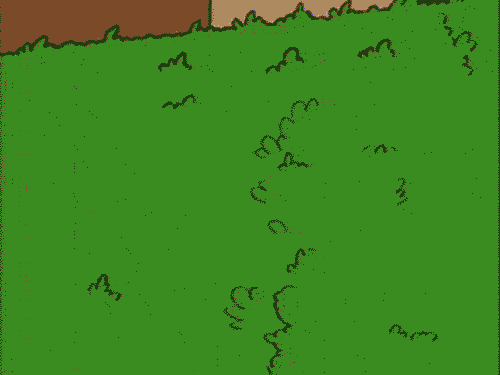

## Hi there! 👋 [line 1]

1. **Introduction** [2.5m]
1. **Key concepts of complex systems** [15m]
1. **Entering the world of agent-based models** [10m]
1. **Real-world applications** [5m]
1. **Final remarks** [2.5m]

# Key concepts of complex systems [line 36]

## Complex *versus* Complicated [line 38]

A biological clock is complex, but a mechanical clock is complicated.

## Complex *versus* Complicated [line 58]

A look at the internals of a mechanical clock.

Elegant and Precise

A watchmaker designed it. It has a specific function. It has a goal.

It may be hard to understand, but if you take the time and look at all of its parts, you can understand the whole system.

## Complex *versus* Complicated [line 76]

A look at the internals of a biological clock (a timing system).

A mess! A bunch of coupled oscillators

"[...] involve great numbers of parts undergoing a kaleidoscopic array of simultaneous interactions." [@holland1992b]

If you look just its parts, you can't understand the whole system.

It's an emergent phenomenon.

It can be thought as an "aggregate agent" ― aggregate behavior of component agents generates behavior of the aggregate agent. [@holland2012]

Boundaries and signals [@holland2012]

It's adaptive, robust, produces extreme events, and is self-organized.

## Emergence [line 106]

(joke) Power Rangers Megazord.

"Esquece o jovem místico".

Illustrative example: Societies; immune cells.

A society is formed by individuals and their interactions. In this case, we are the agents and the society is the aggregate agent. And, as we know, we shape the society, but the society also shapes us.

**Emergence isn't magic** [@wilson2004].

You are dealing with an emergence phenomenon when there is no need to look under the hood [@krakauer2023].

Levels of description [@nicolis2012].

<!--  -->
<!--  -->
<!--  -->

## Chaos [line 140]

Seemingly random behavior can emerge from deterministic systems, with no external source of randomness [@mitchell2009].

See: [Lorenz system](https://danielvartan.github.io/lorenz-system/).

## Pseudonoise [line 170]

## {data-menu-title="NetLogo Web: Schelling's segregation model" background-iframe="https://www.netlogoweb.org/launch#https://www.netlogoweb.org/assets/modelslib/Sample%20Models/Social%20Science/Segregation.nlogo" background-interactive=true} [line 192]

## Generative science [line 197]

Like **deduction**, it starts with a set of explicit assumptions. But unlike deduction, it does not prove theorems. Instead, a simulation generates data that can be analyzed inductively.

Unlike typical **induction**, however, the simulated data comes from a rigorously specified set of rules rather than direct measurement of the real world.

While induction can be used to find patterns in data, and deduction can be used to find consequences of assumptions, simulation modeling can be used as **an aid intuition**.

# Entering the world of agent-based models [line 229]

The main objective of this section is to introduce the concept of agent-based models (ABMs) and other important concepts related to modeling in general.

## Agent-based models [line 235]

## The modeling cycle [line 262]

We have to force ourselves to simplify as much as we can, or even more. The modeling cycle must be started with the most simple model possible, because we want to develop understanding gradually, while iterating through the cycle. A common mistake of begin- ners is to throw too much into the first model version—usually arguing that all these factors are well known and can’t possibly be ignored. The modeling expert’s answer to this is, yes, you might be right, but—let us focus on the absolute minimum number of factors first. Put all the other elements that you think might need to be in the model on your “wish list” and check their importance later [@railsback2019, p. 8].

## Conceptual models [line 274]

## Key components of ABMs [line 285]

## When to use ABMs? [line 304]

## ABM Frameworks [line 327]

# Real-world applications [line 355]

## Historical ecology [line 357]

## Systems biology [line 370]

## Urban planning [line 383]

## ABM + AI: Agent hospital [line 396]

# Final remarks [line 410]

## Summary of key takeaways [line 412]

## How to learn more? [line 423]

## How to learn more? [line 442]

## How to learn more? [line 459]

## Closing Remarks [line 480]

## References [line 500]

## Thank you! [line 512]

## {data-menu-title="QR codes" .nostretch} [line 523]

# Appendices [line 542]

## (AP) A unit of cultural transmission [line 544]

## (AP) Warning [line 563]

## (AP) Complex *versus* Complicated [line 572]

## (AP) Complex *versus* Complicated [line 583]

If someone designed this here, they weren't doing well. This system wasn't designed by a watchmaker, but by evolution.

This is the result of a juggling act of billions of years of evolution. There are no specific functions. There's no proposed goal.

You would hate have this clock. You would be late for everything. Its always changing. That's because it's not a clock, it's a timing system.

## (AP) Complex *versus* Complicated [line 601]

## (AP) Complex *versus* Complicated [line 622]

## (AP) What is a system? [line 649]

## (AP) What is a complex system? [line 672]

## (AP) What is a complex system? [line 695]

## (AP) Complex structures [line 706]

## (AP) The 7 basics [line 732]

## (AP) Human difficulties in understanding complex systems [line 763]

## (AP) Chaos [line 774]

Figure 2.11. Bifurcation diagram for the logistic map, with attractor plotted as a function of R [@mitchell2009].

See also: @muller2020 .

## (AP) Isn't that psychohistory? [line 790]

## (AP) Untangling *versus* Entangling [line 797]

Agent-based modeling is “naive” (DeAngelis et al. 1994) in the sense that we are not trying to aggregate agents and what they are doing in some abstract variables like abundance, biomass, overall wealth, demo- graphic rates, or nutrient fluxes. Instead, we naively and directly represent the agents and their behavior. We create these agents, put them in a virtual environment, and then let the virtual world run and see what we can learn from it [@railsback2019, pp. 7-8]

## (AP) Emergence [line 813]

Microscopic patterns that accumulate over time, similarly to evolutionary patterns.

## (AP) Emergence [line 836]

## (AP) Emergence [line 847]

Emergence shares similarities with evolution. On shorter time scales, we observe the formation of patterns. Over longer time scales, entirely new levels of organization appear, leading to phenomena that seem unrelated to their origins (e.g., a rock and a human).

## (AP) Structural levels [line 871]

Fig. 8. Structural levels in the organization of the nervous system, a reflection of the hierarchical systems that may underlie the generation of higher cognitive functions, including consciousness. Courtesy of Patricia Churchland and Terrence Sejnowski.

## (AP) How can something be more than the sum of its parts? [line 883]

## (AP) Reductionism [line 910]

## (AP) Reductionism *versus* Compression [line 921]

## (AP) Power laws & Factor sparsity [line 934]

## (AP) Power laws & Factor sparsity [line 963]

## (AP) Feedback loops [line 980]

As commonly used, the term "feedback" denotes that an action or activity initiated by someone or something sets in motion activities or responses by others which then affect the original source of the activity [@puccia1985].

## (AP) Robustness [line 1000]

## (AP) Equilibrium states [line 1020]

## (AP) Leverage points [line 1033]

## {visibility="uncounted" data-menu-title="NetLogo Web: Fire model" background-iframe="https://www.netlogoweb.org/launch#https://www.netlogoweb.org/assets/modelslib/Sample%20Models/Earth%20Science/Fire.nlogo" background-interactive=true} [line 1051]

## (AP) Complexity science(s?) [line 1056]

"Figure 1.1: Visual, organizational map of complex systems science broken into seven topical areas. The three circles on the left (Nonlinear Dynamics, Systems Theory, and Game Theory) are the historical roots of complex systems science, while the other four circles (Pattern Formation, Evolution and Adaptation, Networks, and Collective Behavior) are the more recently studied topical areas." [@sayama2015].

## (AP) Map of the complexity sciences [line 1076]

## (AP) *Quem te viu, quem te vê* [line 1089]

## (AP) Other concepts [line 1108]

## {visibility="uncounted" data-menu-title="NetLogo Web: Climate change" background-iframe="https://www.netlogoweb.org/launch#https://www.netlogoweb.org/assets/modelslib/Sample%20Models/Earth%20Science/Climate%20Change.nlogo" background-interactive=true} [line 1140]

## (AP) What is a model? [line 1145]

## (AP) Why use ABM? [line 1170]

By my own experience. Use of ABM in the classroom (Camilo, 2012).

You don’t need to invest in infrastructure to run simulations. You can use your own machine or cloud computing services to execute them.

## (AP) Types of models [line 1196]

ABMs can also be implemented in continuous time, but most are designed as discrete-time simulations.

**Agent-Based Models** (Social Science) *versus* **Individual-Based Models** (IBMs) (Ecology) *versus* **Multi-Agent Systems** (MAS) (Engineering) *==* **Computer-Based Models**.

## (AP) Del rigor en la ciencia [line 1210]

## (AP) On exactitude in science [line 1231]

## (AP) A map on a scale of 1 to 1 [line 1252]

## (AP) Laplace's demon [line 1281]

## (AP) Laplace's demon [line 1300]

## (AP) The modelling cycle [line 1319]

## (AP) Tools for conceptual modelling [line 1348]

## (AP) Nonrealistic models [line 1369]

## (AP) Nonrealistic models [line 1376]

## {visibility="uncounted" data-menu-title="(AP) Tyson's tweet" .center-x} [line 1387]

The universe is under no obligation to make sense to you [@tyson2021].

## (AP) Analyzing agent-based models [line 1399]

Joke: You can always use other tools, but know that I will judge you for that.

## (AP) Verification and validation [line 1421]

## (AP) Pattern-oriented model design [line 1453]

## (AP) Abstract *versus* Empirical models [line 1464]

*Simple* [@sun2016; @rand2007] or *abstract* [@sun2016] models *versus* *photograph* [@parker2003], *empirical*, *complicated* [@sun2016], *elaborated and realistic (ER)* [@rand2007] models.

Simple model example: Schelling's segregation model [@schelling1971].

We call this the ‘Medawar zone’ because Medawar described a similar relation between the difficulty of a scientific problem and its payoff [@grimm2005a].

## (AP) A picture is worth a thousand words [line 1492]

Understanding local interactions helps identify potential leverage points or types of interactions that can amplify the spread of a phenomenon. For instance, by analyzing contact interactions, one might recommend mask usage or design specific protocols for tracking and isolating infected individuals. A global approach, on its own, would not reveal these crucial details.

See: [SIR model](https://danielvartan.github.io/sir/); [ Lotka–Volterra's predator–prey model](https://danielvartan.github.io/lotka-volterra/).

## (AP) NetLogo [line 1526]

- Logo (Seymour Papert: 1967
- NetLogo (Uri Wilensky): 1999) (Rand, Unit 8).

## (AP) Public health [line 1551]

## (AP) Biophysics [line 1564]

## (AP) Geography [line 1577]

## (AP) Fishery [line 1590]

## (AP) Urban planning [line 1603]

## (AP) Housing market [line 1616]

## (AP) Epidemiology [line 1629]

## (AP) Climatology [line 1642]

## (AP) Social psychology [line 1655]

## {visibility="uncounted" data-menu-title="Epidemiology: Imperial College" background-image="images/imperial-college-covid-sim.png" background-position="top left" background-size="100%" .scrollable} [line 1668]

## {visibility="uncounted" data-menu-title="Climatology: CMIP" background-image="images/cmip-webpage.png" background-position="top left" background-size="100%" .scrollable} [line 1670]

## (AP) ABM + AI: Hide-and-seek [line 1672]

## (AP) ABM + AI: Project Sid [line 1685]

## (AP) Dialectical materialism's conjecture [line 1698]

## (AP) Dialectical materialism's conjecture [line 1706]

## (AP) Dialectical materialism's conjecture [line 1725]

## (AP) Dialectical materialism's conjecture [line 1749]

## (AP) Dialetics and the law of excluded middle [line 1778]

## (AP) Popper's vision of science [line 1785]

## (AP) Dialetics: a non-falsiable conjecture [line 1804]

## (AP) Popper *versus* Dialetical materialism [line 1813]

## (AP) Popper *versus* Dialetical materialism [line 1828]

## (AP) Popper *versus* Dialetical materialism [line 1839]

## (AP) Popper *versus* Dialetical materialism [line 1848]

## (AP) Popper *versus* Dialetical materialism [line 1862]

## (AP) Popper *versus* Dialetical materialism [line 1875]

## (AP) Popper's hypothetico-deductive method [line 1886]

## (AP) Popper's hypothetico-deductive method [line 1921]

## (AP) Popper's hypothetico-deductive method [line 1942]

## (AP) Popper against positivism (or the problem of induction) [line 1964]

## (AP) Popper against positivism (or the problem of induction) [line 1974]

## (AP) Popper against positivism (or the problem of induction) [line 1985]

## (AP) The 7 conclusions of Popper on science [line 2004]

## (AP) The 7 conclusions of Popper on science [line 2024]

## (AP) The 7 conclusions of Popper on science [line 2045]

## (AP) The 7 conclusions of Popper on science [line 2066]

## (AP) The 7 conclusions of Popper on science [line 2086]
